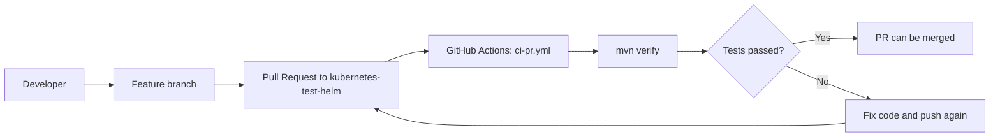
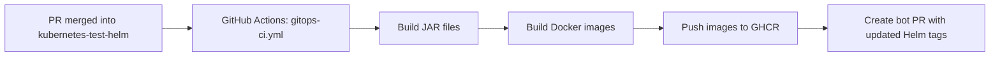
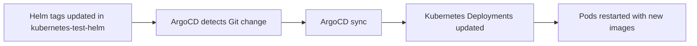
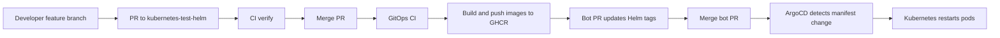
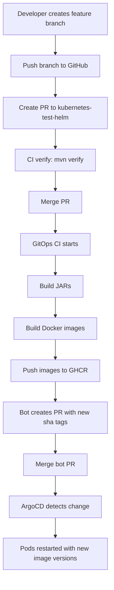

# DevOps Architecture

## Overview

Проект использует GitOps-подход для CI/CD.

Основные компоненты:

| Компонент | Назначение |
|---|---|
| GitHub | Хранение исходного кода |
| GitHub Actions | CI/CD пайплайны |
| GHCR | Хранилище Docker-образов |
| Helm | Kubernetes manifests |
| ArgoCD | GitOps deployment |
| Kubernetes | Среда исполнения |

---

## 1. CI pipeline для Pull Request

Файл:

```text
.github/workflows/ci-pr.yml
```

Этот workflow запускается, когда открывается PR в ветку `kubernetes-test-helm`.



Что делает pipeline:

1. Проверяет код перед merge.
2. Запускает Maven verification:

```bash
mvn -B verify
```

3. Если тесты упали, PR не должен быть вмержен.

---

## 2. GitOps build pipeline после merge

Файл:

```text
.github/workflows/gitops-ci.yml
```

Этот workflow запускается на `push` в ветку `kubernetes-test-helm`.



Что делает pipeline:

1. Собирает JAR-файлы:

```bash
mvn -B -DskipTests package
```

2. Для каждого сервиса собирает Docker image.
3. Публикует образы в GHCR.
4. Создаёт PR от бота, который обновляет `tag:` в Helm values-файлах.

---

## 3. Где хранятся Docker images

Все application-образы хранятся в GHCR.

Пример:

```text
ghcr.io/gitueser/selmag/admin-server
```

Тег образа привязан к короткому SHA коммита:

```text
sha-da4518d
```

Это даёт:

- воспроизводимость;
- immutable deployment;
- понятный rollback;
- удобную проверку, какая версия реально крутится в кластере.

---

## 4. Bot PR для обновления Helm tags

После сборки и публикации образов pipeline создаёт ветку вида:

```text
ci/update-image-tags-<shortsha>
```

И открывает PR, который обновляет файлы:

```text
helm/selmag/subcharts/services/*/values.yaml
```

Пример:

```yaml
image:
  repository: ghcr.io/gitueser/selmag/admin-server
  tag: "sha-da4518d"
```

Пока этот PR не вмержен, ArgoCD не будет выкатывать новые образы, потому что source of truth для deploy — это Git manifests.

---

## 5. ArgoCD deployment logic

ArgoCD следит за веткой:

```text
kubernetes-test-helm
```

Именно эта ветка указана в:

```text
argocd/apps/root.yaml
argocd/apps/selmag.yaml
```

В обоих файлах используется:

```yaml
targetRevision: kubernetes-test-helm
```

Схема работы:



---

## 6. Что реально происходит после merge bot PR

Полный путь изменений:



То есть у вас deploy идёт не напрямую из CI в кластер, а через GitOps-слой:

```text
Code -> Image -> Git manifests -> ArgoCD -> Cluster
```

---

## 7. Как проверить, какие образы реально крутятся в Kubernetes

### Проверка image tag

```bash
kubectl -n selmag-helm get pods -o=jsonpath='{range .items[*]}{.metadata.name}{"\t"}{range .spec.containers[*]}{.image}{" "}{end}{"\n"}{end}'
```

### Проверка imageID / digest

```bash
kubectl -n selmag-helm get pods -o=jsonpath='{range .items[*]}{.metadata.name}{"\t"}{range .status.containerStatuses[*]}{.imageID}{" "}{end}{"\n"}{end}'
```

### Расширенная удобная команда

```bash
kubectl -n selmag-helm get pods -o jsonpath='{range .items[*]}{.metadata.name}{"\n"}{range .status.containerStatuses[*]}  {.name}{"\n"}    image:   {.image}{"\n"}    imageID: {.imageID}{"\n"}{end}{"\n"}{end}'
```

Сравнивать нужно:

1. `tag:` из Helm values;
2. `image:` в pod;
3. `imageID:` в pod;
4. digest на странице Packages в GitHub.

Если digest в кластере совпадает с digest в GHCR, значит именно этот образ реально запущен.

---

## 8. Где смотреть результаты работы pipeline

### GitHub Actions

Вкладка:

```text
GitHub -> Actions
```

Там проверяются два workflow:

- `CI (PR verify)`
- `GitOps CI (build/push + update Helm)`

### GitHub Packages

Вкладка:

```text
GitHub -> Packages
```

Там видны все опубликованные версии образов и их digest.

### Pull Requests

Вкладка:

```text
GitHub -> Pull requests
```

Там появляются:

- обычные PR от разработчика;
- автоматические PR от бота на обновление Helm tags.

### ArgoCD

Вкладка / UI:

```text
ArgoCD -> Applications
```

Там видно:

- статус `Progressing`;
- статус `Healthy`;
- текущие images;
- синхронизацию с Git.

---

## 9. Какие сервисы входят в CI/CD pipeline

В pipeline входят только application services:

- admin-server
- api-gateway
- catalogue-service
- config-server
- customer-app
- eureka-server
- feedback-service
- manager-app

Для них:

- собираются JAR;
- собираются Docker images;
- публикуются образы в GHCR;
- обновляются Helm tags.

---

## 10. Что НЕ входит в этот pipeline

Следующие компоненты не собираются текущим application pipeline:

- PostgreSQL
- MongoDB
- Keycloak
- observability stack

Почему:

1. Это инфраструктурные компоненты.
2. Они не являются вашими Java-сервисами.
3. Их образы берутся из официальных registry или фиксированных официальных image sources.
4. Их жизненный цикл обычно управляется отдельно от application code.

В текущем pet-project setup они могут жить в кластере, что нормально для dev-среды.

Для production чаще делают иначе:

- базы данных выносят отдельно;
- Keycloak разворачивают как отдельный сервис;
- observability также выносят отдельно;
- данные и бэкапы управляются отдельно.

---

## 11. Почему у вас source of truth — это Git

Главная идея GitOps:

```text
Кластер не должен быть источником правды.
Источником правды должен быть Git.
```

Поэтому:

- нельзя просто запушить образ и считать deploy завершённым;
- нужно ещё обновить Helm manifests в Git;
- только после этого ArgoCD применяет изменения в кластер.

Это объясняет, почему bot PR обязателен в текущем подходе.

---

## 12. Итоговый рабочий flow проекта

Итоговая схема:



---

## 13. Практический FAQ

### Где лежат GitHub Actions файлы?

```text
.github/workflows/ci-pr.yml
.github/workflows/gitops-ci.yml
```

### Какая deploy-ветка сейчас используется?

```text
kubernetes-test-helm
```

### Где это настроено?

```text
argocd/apps/root.yaml
argocd/apps/selmag.yaml
```

### Что делает `ci-pr.yml`?

Проверяет PR через `mvn verify`.

### Что делает `gitops-ci.yml`?

После merge:

- собирает JAR;
- собирает Docker images;
- пушит их в GHCR;
- создаёт PR с новыми `sha-*` tags в Helm.

### Когда ArgoCD реально выкатывает новую версию?

Только после merge bot PR с обновлёнными Helm tags.

### Где смотреть image digest?

- GitHub Packages
- `kubectl ... imageID`
- ArgoCD application details

### Почему PostgreSQL/Mongo/Keycloak не идут через тот же pipeline?

Потому что это инфраструктура, а не application build.

---

## 14. Полезные команды

### Посмотреть pods

```bash
kubectl -n selmag-helm get pods -o wide
```

### Посмотреть image tags

```bash
kubectl -n selmag-helm get pods -o=jsonpath='{range .items[*]}{.metadata.name}{"\t"}{range .spec.containers[*]}{.image}{" "}{end}{"\n"}{end}'
```

### Посмотреть image digests

```bash
kubectl -n selmag-helm get pods -o=jsonpath='{range .items[*]}{.metadata.name}{"\t"}{range .status.containerStatuses[*]}{.imageID}{" "}{end}{"\n"}{end}'
```

### Удобный расширенный вывод

```bash
kubectl -n selmag-helm get pods -o jsonpath='{range .items[*]}{.metadata.name}{"\n"}{range .status.containerStatuses[*]}  {.name}{"\n"}    image:   {.image}{"\n"}    imageID: {.imageID}{"\n"}{end}{"\n"}{end}'
```

---

## 15. Заключение

В проекте реализован полноценный GitOps deployment flow:

- разработчик работает через PR;
- GitHub Actions валидирует код;
- после merge собираются новые образы;
- новые образы публикуются в GHCR;
- бот обновляет Helm tags через PR;
- после merge ArgoCD выкатывает изменения в кластер.

Для pet-project это уже очень сильная и практически production-похожая DevOps архитектура.
